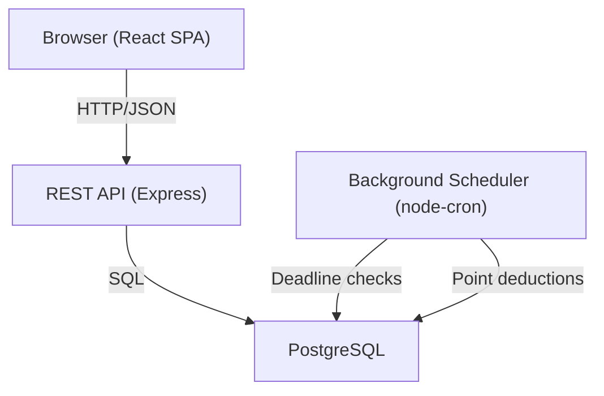

# Design Document: Team Task Manager

## Overview

A full-stack web application for team task management with role-based access, a point-based scoring system, leaderboard, weekly recaps, and announcements. The system uses a React frontend, a Node.js/Express REST API backend, and a PostgreSQL database. Authentication is handled via JWT tokens stored in HTTP-only cookies.

---

## Architecture



- **Frontend**: React + TypeScript SPA, communicates with the API over REST.
- **Backend**: Express REST API, handles auth, business logic, and data access.
- **Database**: PostgreSQL with relational tables for users, tasks, points, and announcements.
- **Scheduler**: A background cron job runs periodically (e.g., every minute) to detect expired deadlines and apply point deductions.

---

## Components and Interfaces

### Frontend Pages / Components

| Component | Role |
|---|---|
| `LoginPage` | Credential form, calls `POST /auth/login` |
| `Dashboard` | Landing page after login; shows tasks, announcements |
| `TaskList` | Lists tasks relevant to the current user |
| `TaskForm` | Form for submitting a new task (Team Member) |
| `TaskAssignModal` | Admin form to assign/reassign a task with deadline |
| `Leaderboard` | Ranked list of team members by points |
| `WeeklyRecap` | Summary view of the past 7 days |
| `AnnouncementBoard` | Displays announcements; admin can create/delete |
| `ProfilePage` | Shows current user's points balance and transaction history |

### Backend API Routes

#### Auth
| Method | Path | Description |
|---|---|---|
| POST | `/auth/login` | Authenticate user, return JWT |
| POST | `/auth/logout` | Invalidate session |

#### Tasks
| Method | Path | Description |
|---|---|---|
| GET | `/tasks` | List tasks (filtered by role) |
| POST | `/tasks` | Team Member submits a task |
| PATCH | `/tasks/:id/assign` | Admin assigns task + deadline |
| PATCH | `/tasks/:id/confirm` | Team Member confirms completion |

#### Points
| Method | Path | Description |
|---|---|---|
| GET | `/points/me` | Current user's balance + history |
| GET | `/points/leaderboard` | All users ranked by points |

#### Recap
| Method | Path | Description |
|---|---|---|
| GET | `/recap/weekly` | Weekly recap data |

#### Announcements
| Method | Path | Description |
|---|---|---|
| GET | `/announcements` | List all announcements |
| POST | `/announcements` | Admin creates announcement |
| DELETE | `/announcements/:id` | Admin deletes announcement |

---

## Data Models

### `users`
```sql
id          UUID PRIMARY KEY
name        TEXT NOT NULL
email       TEXT UNIQUE NOT NULL
password    TEXT NOT NULL  -- bcrypt hash
role        TEXT NOT NULL CHECK (role IN ('admin', 'member'))
points      NUMERIC(10,2) NOT NULL DEFAULT 0
created_at  TIMESTAMPTZ NOT NULL DEFAULT now()
```

### `tasks`
```sql
id            UUID PRIMARY KEY
description   TEXT NOT NULL
submitted_by  UUID REFERENCES users(id)
assigned_to   UUID REFERENCES users(id)
deadline      TIMESTAMPTZ
status        TEXT NOT NULL CHECK (status IN ('pending', 'assigned', 'completed', 'missed'))
submitted_at  TIMESTAMPTZ NOT NULL DEFAULT now()
completed_at  TIMESTAMPTZ
```

### `point_transactions`
```sql
id          UUID PRIMARY KEY
user_id     UUID REFERENCES users(id)
task_id     UUID REFERENCES tasks(id)
delta       NUMERIC(10,2) NOT NULL   -- +3.0 or -1.5
reason      TEXT NOT NULL            -- 'completion' | 'missed_deadline'
created_at  TIMESTAMPTZ NOT NULL DEFAULT now()
```

### `announcements`
```sql
id          UUID PRIMARY KEY
author_id   UUID REFERENCES users(id)
content     TEXT NOT NULL
created_at  TIMESTAMPTZ NOT NULL DEFAULT now()
```

---

## Correctness Properties

*A property is a characteristic or behavior that should hold true across all valid executions of a system — essentially, a formal statement about what the system should do. Properties serve as the bridge between human-readable specifications and machine-verifiable correctness guarantees.*

### Property 1: Points balance equals sum of transactions

*For any* team member, their `users.points` balance must always equal the sum of all `point_transactions.delta` values for that user.

**Validates: Requirements 5.1, 5.2, 5.3**

---

### Property 2: Completed task awards exactly 3 points

*For any* task confirmed before its deadline, the resulting point transaction must have a delta of exactly +3.0.

**Validates: Requirements 3.3, 5.2**

---

### Property 3: Missed deadline deducts exactly 1.5 points

*For any* task whose deadline passes without confirmation, the resulting point transaction must have a delta of exactly -1.5.

**Validates: Requirements 4.5, 5.3**

---

### Property 4: No duplicate confirmations

*For any* task, the number of "completed" status transitions must be at most 1 — confirming the same task twice must not produce a second point transaction.

**Validates: Requirements 3.5**

---

### Property 5: Leaderboard order invariant

*For any* snapshot of user points, the leaderboard list must be sorted such that for every adjacent pair (a, b), `a.points >= b.points`, and when `a.points == b.points`, `a.name <= b.name` lexicographically.

**Validates: Requirements 6.1, 6.2**

---

### Property 6: Weekly recap point totals are consistent

*For any* 7-day window, the sum of all `point_transactions.delta` values within that window must equal the sum of each team member's net change reported in the Weekly_Recap.

**Validates: Requirements 7.2**

---

### Property 7: Announcements are returned in reverse chronological order

*For any* set of announcements, the list returned by `GET /announcements` must be ordered such that for every adjacent pair (a, b), `a.created_at >= b.created_at`.

**Validates: Requirements 8.3**

---

### Property 8: Role-based access enforcement

*For any* request to an admin-only endpoint made by a Team_Member session, the system must return a 403 response and must not mutate any data.

**Validates: Requirements 1.4, 8.5**

---

## Error Handling

| Scenario | HTTP Status | Behavior |
|---|---|---|
| Invalid login credentials | 401 | Return error message, no session created |
| Unauthenticated request to protected route | 401 | Reject request |
| Team Member accessing admin route | 403 | Reject request, no data mutation |
| Task submission with empty description | 400 | Validation error returned |
| Task assignment without deadline | 400 | Validation error returned |
| Confirming a task not assigned to the requester | 403 | Reject action |
| Confirming an already-completed task | 409 | Conflict error returned |
| Announcement with empty content | 400 | Validation error returned |
| Deadline deduction already applied | idempotent | Scheduler skips tasks already marked 'missed' |

---

## Testing Strategy

### Dual Testing Approach

Both unit tests and property-based tests are required and complementary:

- **Unit tests** cover specific examples, edge cases, and error conditions (e.g., confirming a task after deadline, empty submission rejection).
- **Property-based tests** verify universal correctness properties across randomly generated inputs.

### Property-Based Testing

Use **fast-check** (TypeScript/JavaScript) for property-based testing on the backend service layer.

Each property test must:
- Run a minimum of **100 iterations**
- Be tagged with a comment in the format: `Feature: team-task-manager, Property N: <property_text>`
- Reference the design property it validates

| Property | Test Description |
|---|---|
| Property 1 | For random sequences of task completions and misses, assert `users.points == SUM(point_transactions.delta)` |
| Property 2 | For any task confirmed before deadline, assert transaction delta == +3.0 |
| Property 3 | For any task with expired deadline, assert transaction delta == -1.5 |
| Property 4 | For any task, confirming it twice must not create two transactions |
| Property 5 | For any random user points array, assert leaderboard sort is correct |
| Property 6 | For any 7-day window, assert recap totals match transaction sums |
| Property 7 | For any set of announcements, assert returned order is reverse chronological |
| Property 8 | For any admin-only endpoint, assert Team_Member requests return 403 with no side effects |

### Unit Testing

Use **Jest** for unit and integration tests.

Focus areas:
- Auth middleware (valid/invalid JWT, role checks)
- Task state machine transitions (pending → assigned → completed / missed)
- Points service (award, deduct, balance calculation)
- Announcement CRUD validation
- Scheduler logic (deadline detection, idempotency)
